# Практическая работа по теме Практическое применение Docker #  
## Задача 0 ##  
Создал ВМ Ubuntu 20  
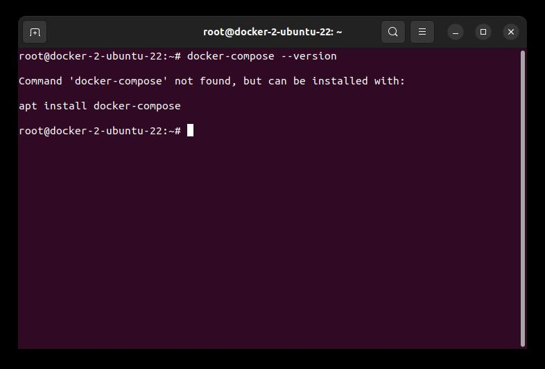  
Установил свежий docker-compose  
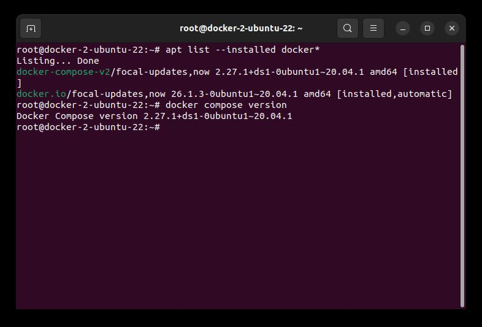  
## Задача 1  ##  
### Создал fork репозитория  ###  
https://github.com/uxtuahgp/shvirtd-example-python/tree/main  
### Скопировал и дополнил Dockerfile.python ###  
https://github.com/uxtuahgp/shvirtd-example-python/blob/main/Dockerfile.python  
### Создал файл .dockerignore ###   
https://github.com/uxtuahgp/shvirtd-example-python/blob/main/.dockerignore  
### Склонировал репозиторий на ВМ ###   
git clone https://github.com/uxtuahgp/shvirtd-example-python
Далее при изменениях 
docker compose down -d
git pull  
### Сборка проекта ###
docker build --tag docker-2:latest -f Dockerfile.python .
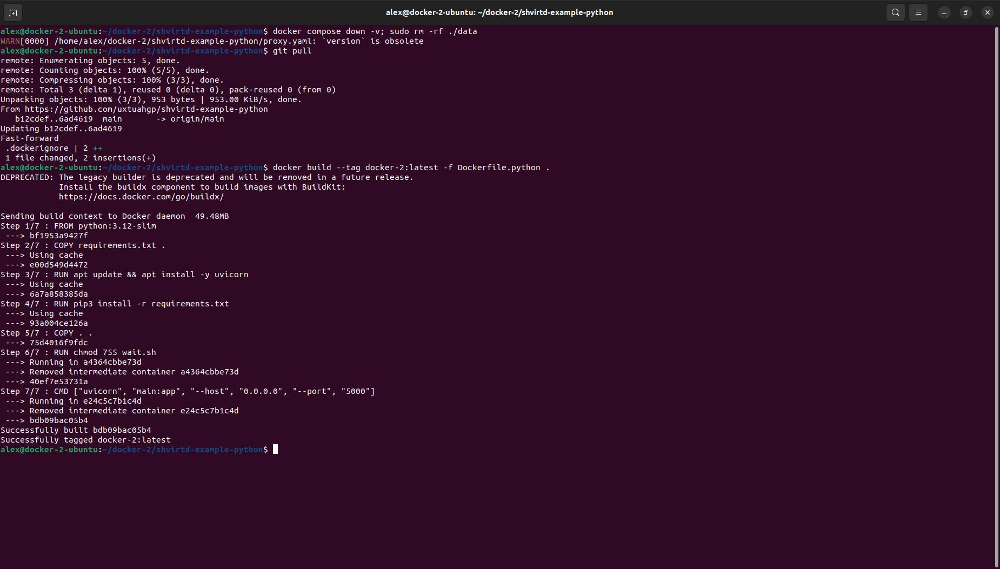
### Запуск docker compose 
При попытке запуска приложение python падало, как в результате я понял, из-за того, что на момент его запуска БД еще не была готова.  
Добавил healthcheck в сервис db:  
    healthcheck:  
      test: "echo 'show databases' | mysql -hlocalhost -u${MYSQL_USER} -p${MYSQL_PASSWORD} |grep ${MYSQL_DATABASE}"  
      timeout: 3s  
      retries: 20  
Добавил в сервис web depends_on:  
    depends_on:  
      db:  
        condition: service_healthy  
Проследил по логу зазапуском контейнеров  
Проверил работу приложения с помощью curl  
  
## Задача 1.3 * ##
Для запуска приложения на ВМ  
### Установил python3.8-venv ###  
sudo apt install python3.8-venv  
### Создал виртуальное окружение  ###  
python3 -m venv venv  
source venv/bin/activate  
### Установил зависимости ###  
pip install -r requirements.txt  
### Установил переменные окружения для запуска приложения ###  
export DB_HOST='127.0.0.1'    
export DB_USER='app'  
export DB_PASSWORD='very_strong'  
export DB_NAME='example' 
export DB_TABLE='reqs'
### Запустил сервер MySQL в контейнере ###  
Для venv писался отдельный compose с единственным сервисом mysql
### Запустил uvicorn ###
uvicorn main:app --host 0.0.0.0 --port 5000 --reload
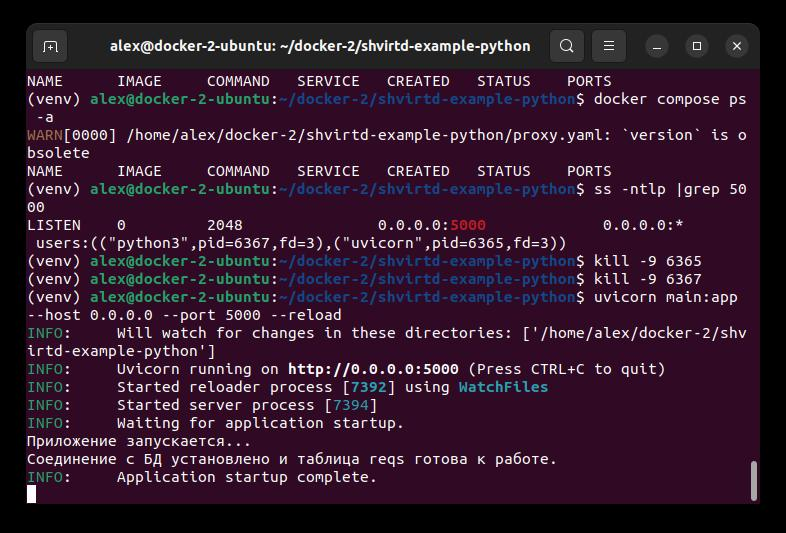  
## Задача 1.4 * ##  
Добавил в compose.yaml переменную DB_TABLE  
В коде main.py добавил извлечение в переменную из переменной среды  
db_table = os.environ.get('DB_TABLE', 'requests')  
В трех запросах вместо статического текст добавил заначения из контстанты.  
db_table = os.environ.get('DB_TABLE', 'requests')  

query = "INSERT INTO "+db_table+" (request_date, request_ip) VALUES (%s, %s)"  

query = "SELECT id, request_date, request_ip FROM "+db_table+" ORDER BY id DESC LIMIT 50"  
# Задача 2 #
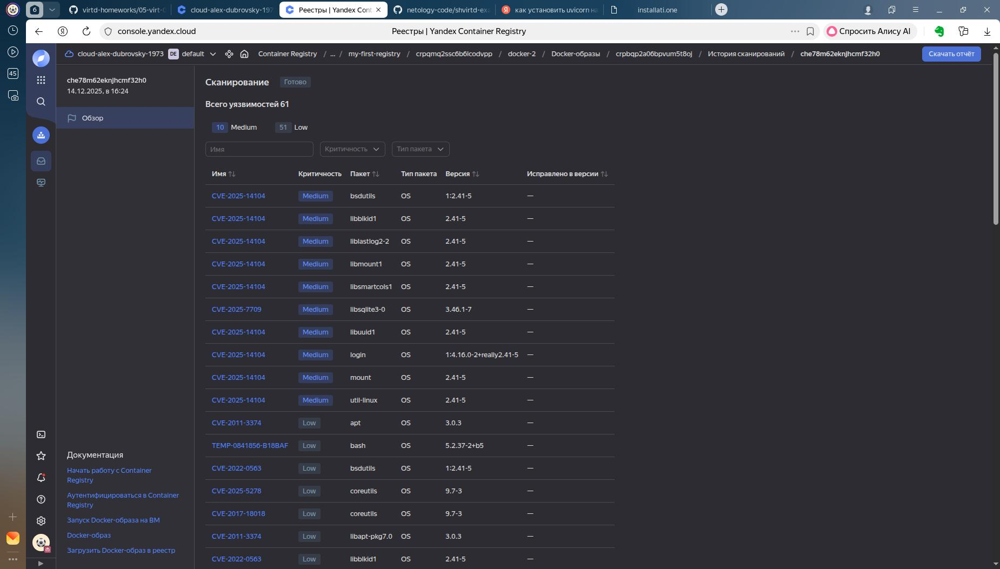  
https://github.com/uxtuahgp/devops-study/blob/main/docker-2-vulnerabilities.csv    

# Задача 3 #  
Для соединения с сервисами прокси использовал include  
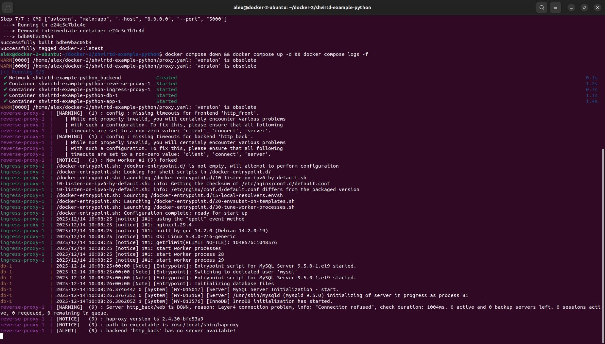  
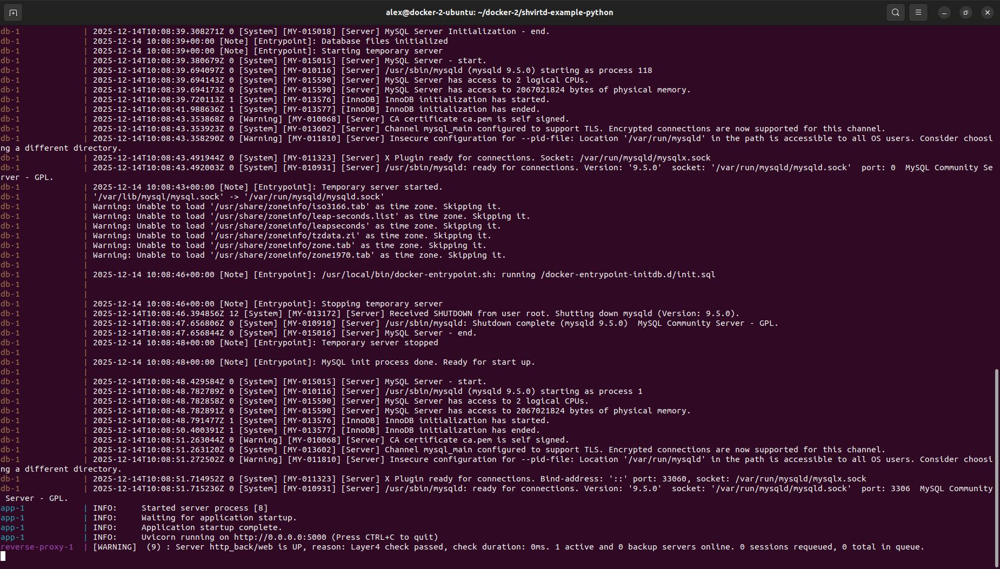  

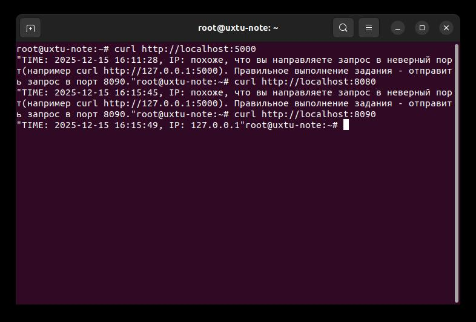  
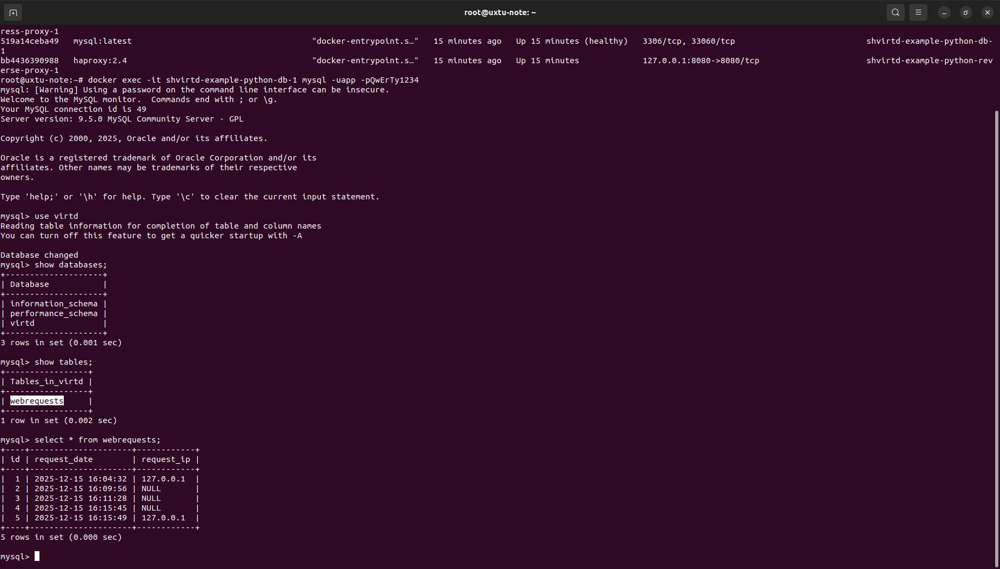  

# Задача 4 #  
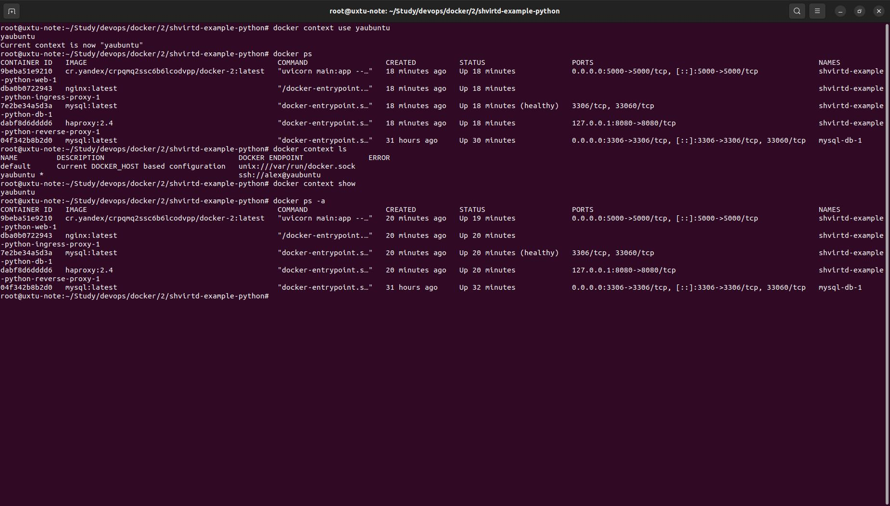  
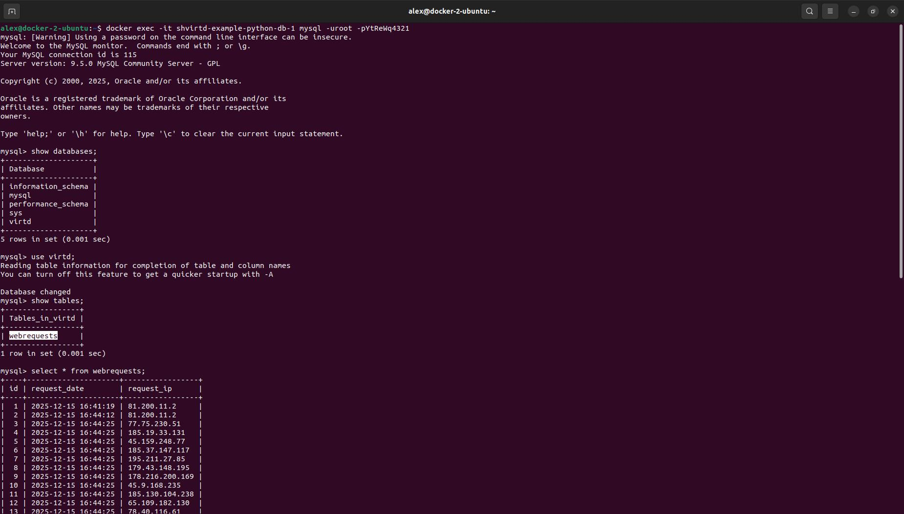  
  

# Задача 5 * #  
# Задача 6 #  
Мне так и не удалось извлечь файл из образа с помощью Dive.  
Я пытался запускать dive в контейнере, пытался поставить локально, но при нажатии CTRL-E ничего не происходит.  
Вероятно я неправильно понял условие задачи.  
В таком случае с помощью dive я могу получить идентификатор слоя в blobs, затем сохранить образ в виде архива, разархивировать его и так же разархивировать нужный слой.  
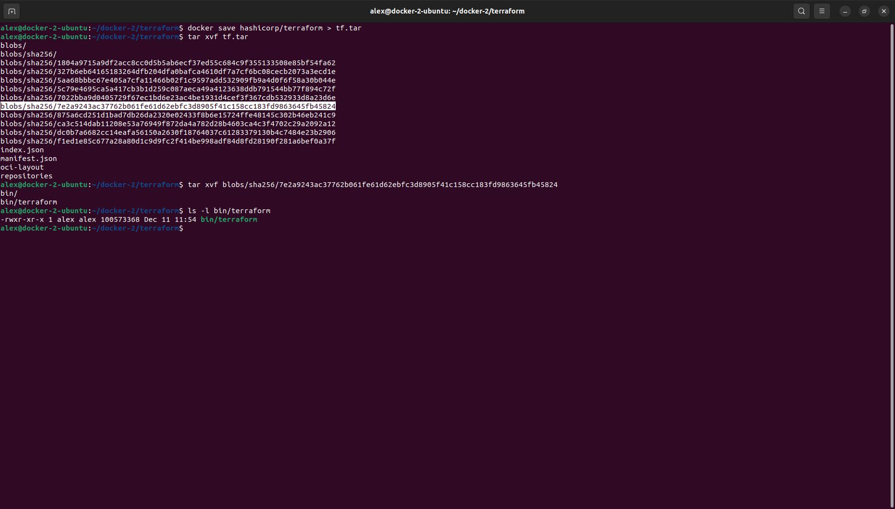  
#  Задача 6.1 #  
С помощью docker create можно создать контейнер, не запуская его, а затем с помощью docker cp извлечь из него нужный файл.  
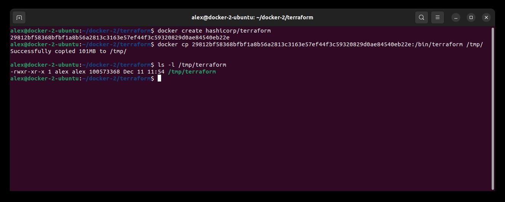  

#  #  

